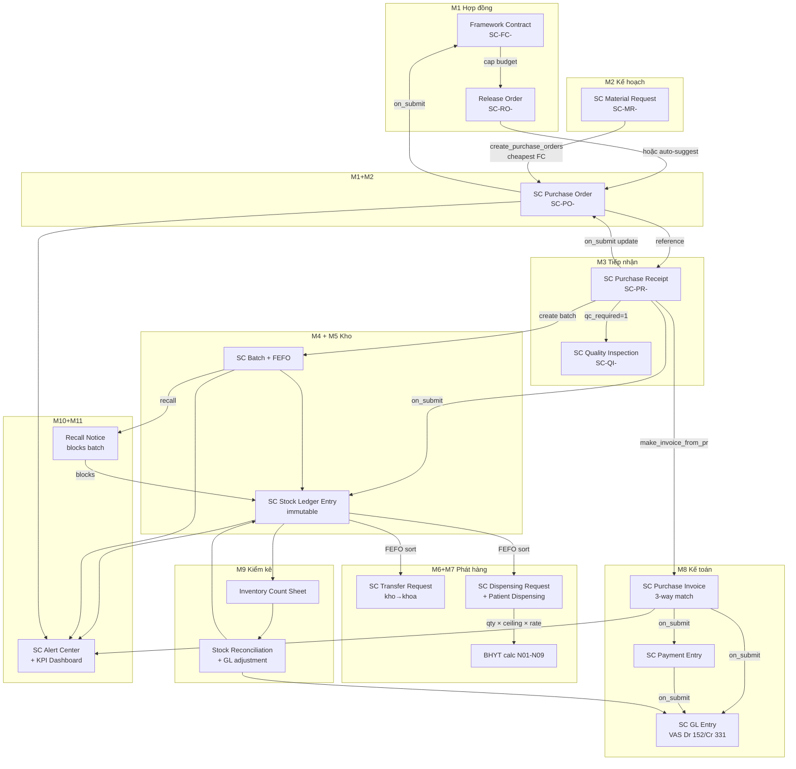

# SupplyCore — End-to-end FLOW chuỗi cung ứng VTYT

**Cập nhật:** 2026-05-08 — slice 1 (procurement MR→PO→PR→PI→GL) + slice 2 (alert→action).

## Sơ đồ tổng thể



## Procurement chain — happy path (đã wire end-to-end)

```
[1] User tạo Material Request (Khoa Nội đặt 50 hộp khẩu trang)
    POST /api/resource/SC%20Material%20Request
    → submit → status=Approved

[2] User click "Tạo Purchase Order" trên MR form
    → MR.create_purchase_orders()
    → m2_planning.api.po_suggest.suggest_po_from_mr(mr, auto_create=1)
    → cho mỗi item: tìm Framework Contract Active có item + đủ remaining_qty,
                   pick FC có unit_price thấp nhất
    → group items theo (supplier, FC) → tạo 1 draft PO/group
    → validate: ΣPO ≤ FC.remaining_value (SC-E002 nếu vượt)

[3] User review PO + submit
    → SC PO controller validate_supplier (dùng helper validate_link)
    → validate_against_framework_contract
    → on_submit → FC.recalculate_used_value (FC.used_value tăng)

[4] Hàng về → User tạo Purchase Receipt từ PO
    → PR.on_submit:
        → tự tạo SC Batch (nếu item.has_batch_no=1 + có expiry_date)
        → post SC Stock Ledger Entry (+qty)
        → auto-tạo SC Quality Inspection (nếu qc_required=1)
        → update SC PO Item.received_qty + PO.status=Received/Partial

[5] User QC pass → click "Tạo Purchase Invoice" trên PR form
    → make_invoice_from_pr(pr) → SC PI draft
    → check duplicate (SC-E007 PI_DUPLICATE)

[6] User nhập supplier_invoice_no thật + submit PI
    → 3-way match check: |PI - PO| / PO ≤ 1% → Match
    → hard cap PI > PO + 5% → SC-E009 OVER_PO_CAP
    → on_submit → post SC GL Entry:
        Dr 152 (Hàng tồn kho)  = subtotal
        Dr 1331 (Thuế GTGT)    = vat_amount
        Cr 331 (Phải trả NCC)  = grand_total
    → status=Approved, outstanding=grand_total

[7] User tạo Payment Entry tham chiếu PI
    → on_submit → post GL: Dr 331 / Cr 1121 (Bank)
    → PI.outstanding giảm + status=Paid khi outstanding=0
```

**Verified bởi `tests/smoke_integration.py`** — chạy thực tế chain 8 bước.
GL Σ Dr = Σ Cr = 55, 3-way match = "Match".

## Stock issue chain (Khoa→Bệnh nhân, FEFO + BHYT)

```
[1] Khoa Nội tạo Transfer Request (qty=10 mặt hàng X từ Kho Tổng)
    → TR validate from≠to, both not group
    → submit → status=Approved

[2] SK click "Tạo SE" trên TR
    → TR.make_stock_entry(): SE Material Transfer draft
    → SK chọn batch (FEFO suggest qua API)
    → submit SE → 2 SLE rows: -qty Kho Tổng / +qty Kho Khoa
    → TR.status=Received

[3] BS đặt thuốc cho bệnh nhân BHYT (Khoa tạo Dispensing Request)
    → DR submit → status=Approved
    → Pharmacy/SK tạo SE Issue (FEFO)
    → tạo Patient Dispensing
    → BHYT calc:
        cfg = SC BHYT Code Config (priority: item-spec > group > fallback)
        effective_rate = min(cfg.payment_rate, patient.bhyt_payment_rate)
        cap = min(unit_cost, cfg.ceiling_price)
        bhyt_amount = qty × cap × effective_rate / 100
        patient_pays = total_cost - bhyt_amount
    → submit PD → SLE (-qty) + ghi nhận hồ sơ BN
```

## Recall + Trace (M10) — đóng vòng audit

```
[1] BYT thông báo lô X bị thu hồi → SK/QC tạo SC Recall Notice
    → input: batch_no, recall_reason, severity (Class I/II/III), recall_type
    → click "Populate Affected Items" → quét SLE + PD Item:
       - location warehouse: tồn còn ở từng kho
       - location patient: bệnh nhân đã dùng (PD)
       - location department: stock đã chuyển khoa (TR)

[2] Submit Recall
    → SC Batch.blocked = 1 + block_reason ghi tên Recall
    → từ giờ mọi SE Issue/Transfer dùng batch này → SC-E008 BATCH_RECALLED
    → status = Issued

[3] Khoa/Patient trả hàng → SK update affected_items.recovered_qty
[4] Outstanding=0 → Recall.status = Completed
```

## Alert + KPI (M11) — observability + actionable

- **Daily 02:00**: `m11_dashboard.tasks.scan_alerts` quét 7 alert types
  (expiring_batch, contract_expiring, fc_remaining_low, low_stock,
  overdue_payment, qc_pending, recall_outstanding) — dedup theo
  rule × reference × 7-day window.
- **Daily 03:00**: `send_daily_kpi` email 6 KPI tới EXEC + MGR.
- **API `get_executive_dashboard`** — JSON 6 KPI realtime.

**Alert → Action (slice 2)**: trên SC Alert form, button context-sensitive:
- `expiring_batch` → "Chuyển vào Kho Cách ly" → SC Stock Entry Material Transfer
- `low_stock` → "Tạo Material Request" → SC MR draft (qty = safety_stock × 2)
- `overdue_payment` → "Tạo Payment Entry" → SC PE draft (auto-fill PI ref)

Sau action: `action_taken=1`, link đến doc đã tạo, alert auto-resolve.

## Phase 1.1+ (defer)

- M2: forecast generation (cần ML/trend) — `generate_procurement_forecast` placeholder
- M4: PDA offline IndexedDB sync
- M11: Frontend Workspace + Number Cards (Phase 3 mockup) — backend đã ready
- M7: BHYT settlement report (báo cáo thanh quyết toán theo period)
- M6/M9: Multi-level approval workflows (Frappe Workflow config)
- M3: Auto-create Return PR khi QI Rejected (schema đã ready)
- ~~M11→M6: low_stock alert auto-create Transfer Request~~ ✅ slice 2 (alert→MR thay vì TR; xem section "Alert + KPI" phía trên)
- Print formats: defer toàn bộ (visual polish)

## Test coverage

| Test | Mục đích | Status |
|---|---|---|
| `tests/smoke_m1..m11.py` | Đơn module — 11 file | ✅ 88 steps |
| `tests/smoke_integration.py` | Cross-module FC→MR→PO→PR→PI→GL | ✅ 8 steps |
| `tests/smoke_alert_action.py` | Alert → Action (M11 actionable) | ✅ 6 steps |
| `tests/uat/uat_runner.py` | UAT REST API (HTTP) cho 11 module | ✅ 44 steps, 100% |

## Vận hành

```bash
# Migrate schema mới (mỗi lần thêm/sửa DocType)
bench --site supplycore migrate

# Build JS (mỗi lần thêm/sửa .js trên DocType form)
bench build --app supplycore

# Test
bench --site supplycore execute "supplycore.tests.smoke_integration.run"
/home/hoangvietyeuem/frappe-bench/env/bin/python tests/uat/uat_runner.py

# Reload sau khi sửa controller .py (production)
sudo supervisorctl restart all
```
